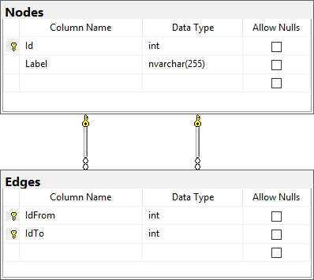

# graph-example

Graph example contains database, server service layer, thin client. The main functionality is to find the shortest path in a graph.

## Solution structure

Entire solution is based on .NET Core.

* **Graph.Resolver** - Dependency resolver and core for Inversion of Control pattern in the solution. The Service Locator pattern and Managed Extensibility Framework (MEF) are used, for abstraction of any IoC. Unity is used as a default IoC.
* **Graph.Domain** - The bussiness logic of the solution, totaly decapled from persistent layer and consumers. Same base design patterns are used, e.g. Singleton, Strategy, Facade, and Builder.
* *Graph.Domain.Test* - Unit test project for domain project.
* **Graph.Model** - Access to persistent layer. The storage is realised by Microsoft SQL database server and Entity Framework Core as a Object-Relational Mapping (ORM). Same base design patterns are used, e.g. Unit of Work.
* *Graph.Model.Interfaces* - The abstraction of model.
* *Graph.Database* - Database project, can be used for creating example database. Any MS SQL server is suitable, even Express Edition.
* **Graph.Util** - Console application for loading a graph into a database.
* **Graph.Services** - Serve WCF and REST web services with a graph data, everything is served in JSON format. *This is the only project which is not in the .NET Core.*
* *Graph.Client.WPF* - WPF example client for graph visualisation. *Not implemented yet.*

## Database Model

## Configuration

This section describing the necessary configuration.

### Graph.Util (console application)

The connection string for database should be specified in **app.config** file.
The aplication can generate help by **/h** or **help** keyword.

### Graph.Services (web server)

The connection string for database must be specified in **web.config** file. Server should be running on **localhost/graph** address.

### Graph.Client.WPF (thin client)

If the REST services are running on the different address then **localhost/graph** the configuration at **app.config** file need to be changed.

